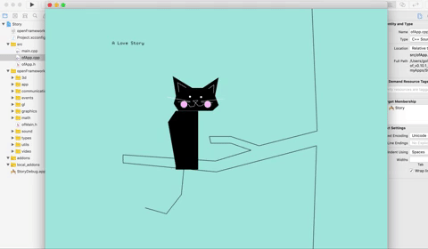

# Assigment_6

## C++

Assemble at least one scene from your story with a title in a font of your choice.

Choose an active element (not static scenery).

Write the code necessary to move it with the arrow keys or mouse dragging.

Choose a second element that moves to a given x,y when the mouse button is clicked.

When key 'f' is pressed, toggle writing to a fading fbo instead of directly to the screen

### A Love Story

 -Moving the black cat's tail with arrow keys or mouse draggig.

 -The gray cat moves to a given xy when the mouse button is clicked.

First scene:

