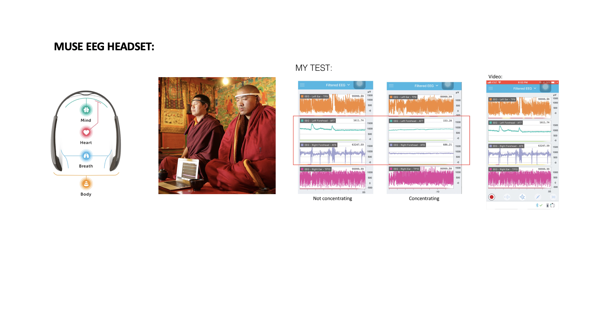
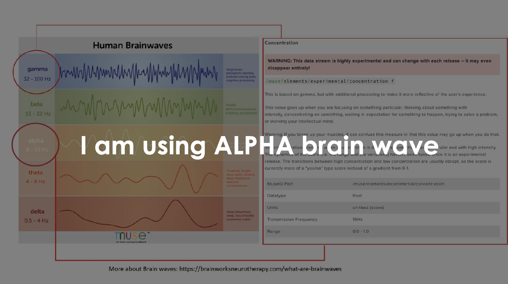
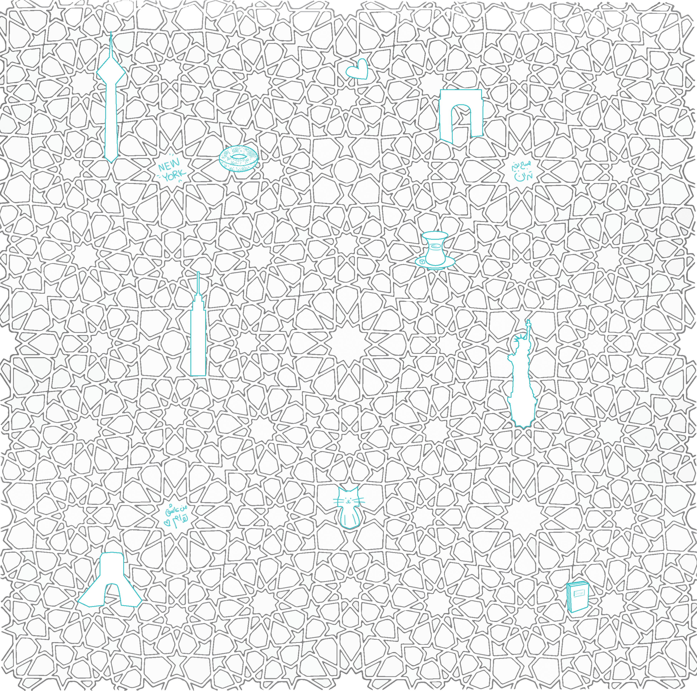
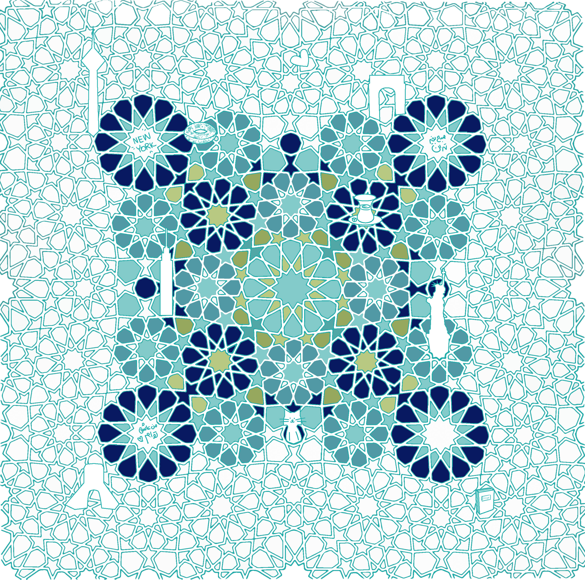
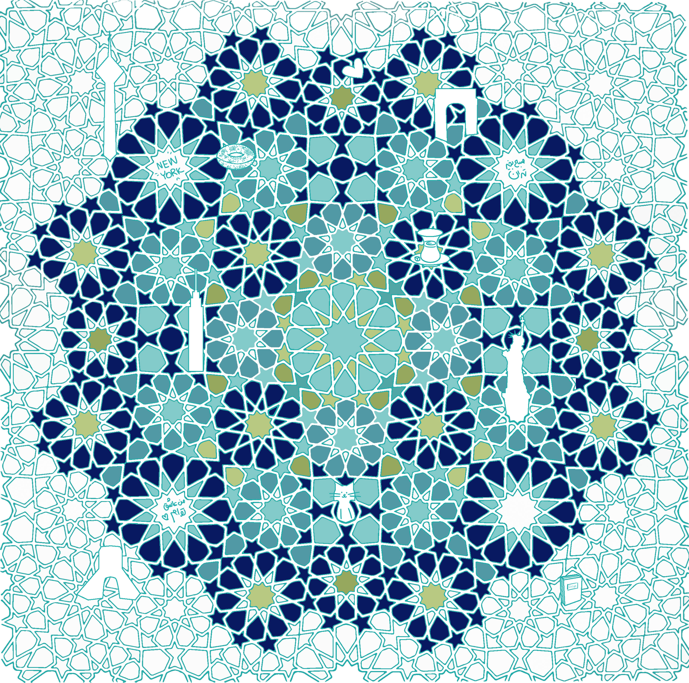
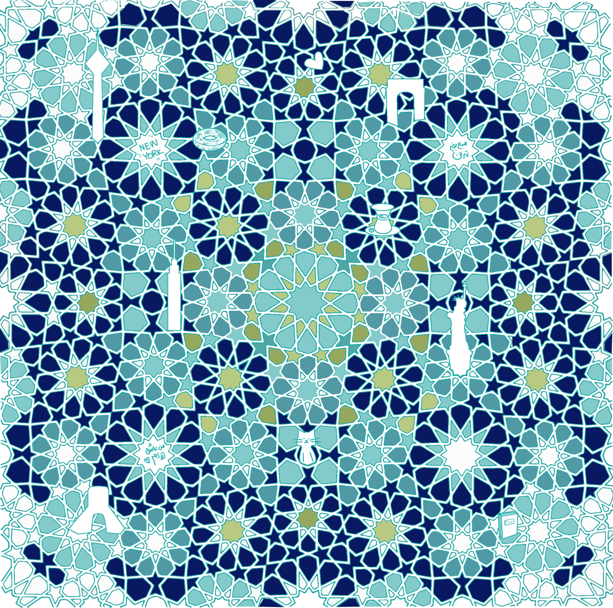

## CONCENTRATION GAME
### COLOR WITH YOUR BRAIN:

My goal is to make a concentration tool for Iranian young people like me who feel stressed because of political/social online trauma.

### Physical prototype:

### Using MUSE EEG headset:

### Inspiration from Iranian architecture pattern:

### My pattern:

Using elements from New York city and Tehran (my hometown)

### User test:

### Coloring book Idea, a coloring book for your brain:

### Final Design:

Concentrate and color the pattern!

