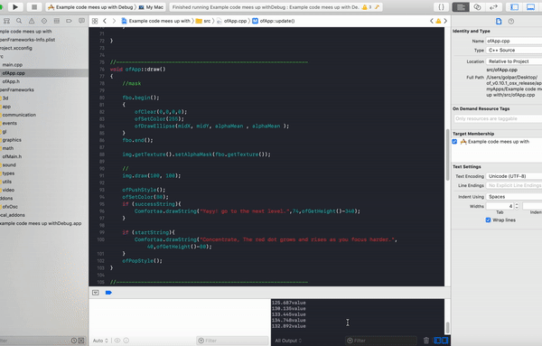

# GAME
<<<<<<< HEAD

=======
My goal is to make a concentration tool for people who feel stressed because of political/social online trauma.
Lack of concentration. It is a normal and periodic occurrence for most people. Tiredness, emotional stress, anxiety, and depression can cause concentration problems in most people. But how can one fight this? How can one train his/her brain to concentrate on demand?

### Reading Alpha wave:

### Circle restarts to 0 each time that the player looses concentration:

This way it is really hard to concentrate and make the circle big all at once, so I made a change:

### Circle does not restart each time that the player losses concentration, instead it remains in the same size and the player can build it up and make it bigger and bigger as he/she concentrates more:

### User test:
All my user tests, were able to made the circle bigger on their own when I set the level to easy, but they had problem when I made it harder -meaning they had to concentrate deeper.
For helping to the actuall concentration process, I asked my players to color the pattern (on a physical paper with color pencils) to observe if doing that activity would make the circle bigger and helps the player to actually concentrate more. 

>>>>>>> 3a8c61fde9c084c248a5530b8b5ff625d0f91277
