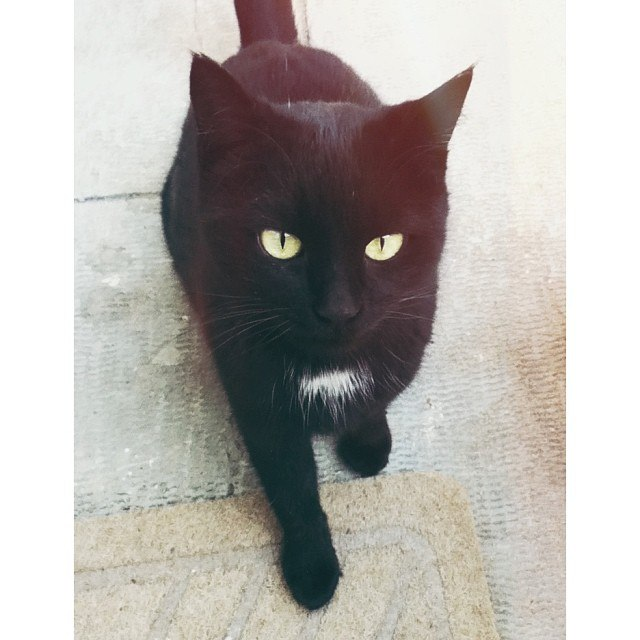
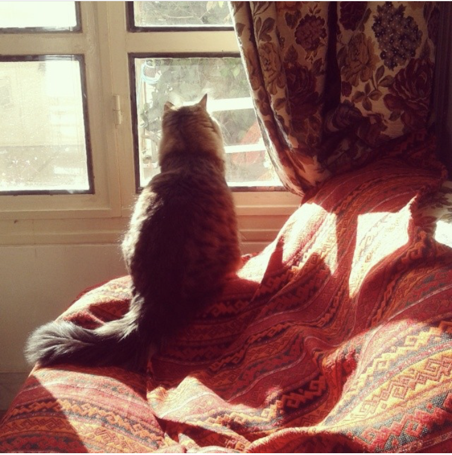
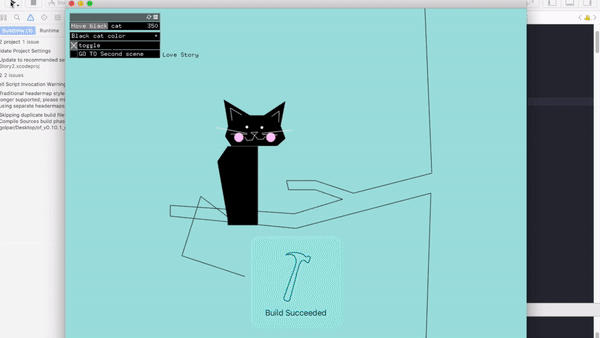
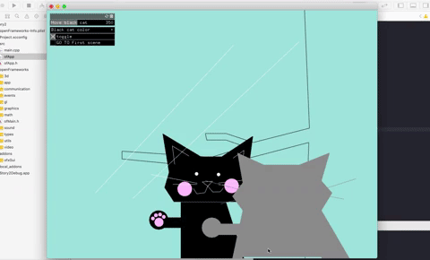
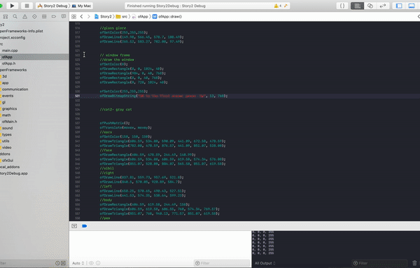

# Story

## C++

## Project1:
#### Due: Sunday May 12th @ 12pm - Points: 15
Your goal is to relate a narrative using primitive shapes, colors, sound and movement. All of the code should be bespoke (no functionality copied from online sources). It is highly recommended that you choose a story you are invested in telling and feel strongly about. The experience itself should require around 5 minutes from the user.

#### Requirements
Your story should include shapes (incl. polygons), movement, sound, images

At least two "scenes" (You can scroll between scenes or draw a new one)

A 5 minute experience

A github link submitted to canvas with code, process assets, and the appropriate .md information

An explanation of your process in the .md

-----------------------------------------

# My story: A Love Story
The story is about a stray cat falling in love with an indoor cat. It is based on the true story:

The black cat's name is Katayoon (aka the stray cat):

   

The indoor cat's name is Gorbesun (aka my cat):

   

   The Story: 
  A black cat is sitting on a tree. A gray cat is watching her inside a home from a window. 
These two fall in love.

### First scene:

-Moving the black cat's tail with mouse movement.

-The gray cat moves to a given x when the left or right bottun is pressed.

Adding a gui slider to have more control over the black cat:

  
### Second scene:

  
### When touching paws a heart appears + adding the window frame

## Final scene:
## Combining two scenes:
You can toggle between the two scenes by pushing the up and down arrow keys on the keyboard. 

